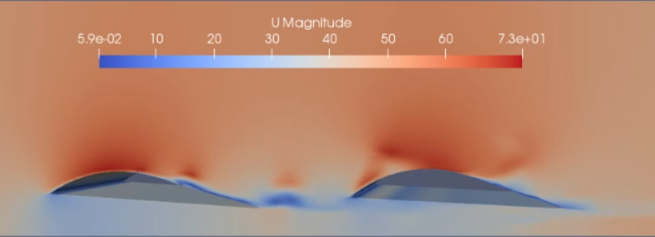

## Ground Effect vehicle CFD analysis

A friend and I teamed up to analyze an interesting vehicle which flies above the surface of water much faster than a boat, but more efficiently than a plane using the ground effect using CFD simulations with OpenFOAM.

 

---

### Pressure field
We managed to obtain really interesting results, both in stationary regime, but also interactions between the wings in transitory regime.

 

---

### Velocity field
In this case, the structured mesh we created, ensured that fine details in the turbulence and in the interactions between the wings appeared in transitory regimes.

 