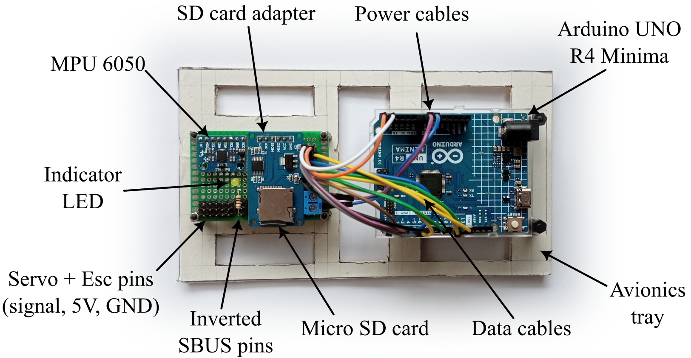
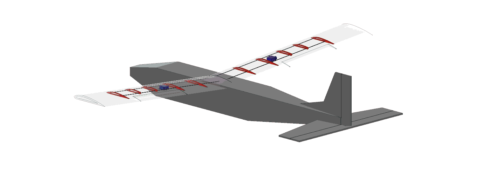
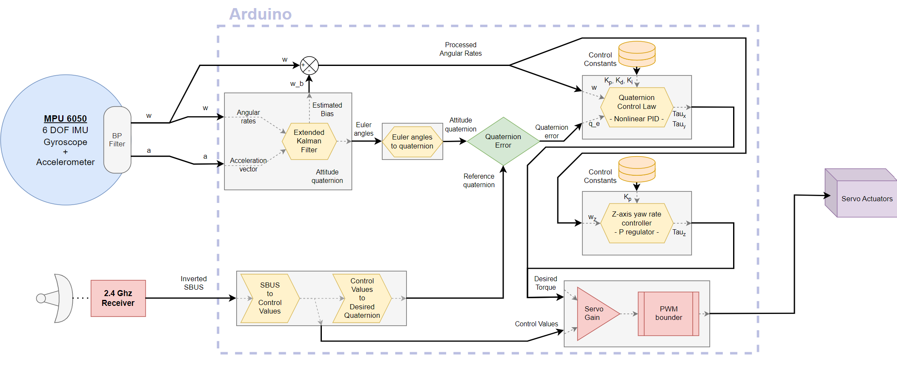
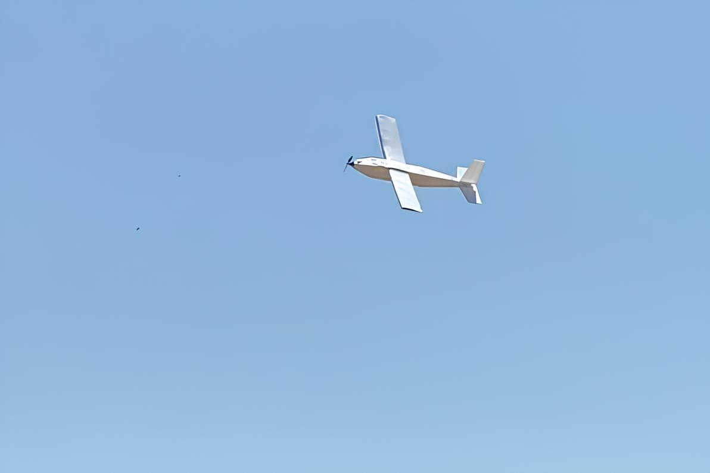

## Design and build of an autonomous UAV

It had been too long already since I attempted to build something that flies so, armed with an aerospace engineering degree, last summer I set out to make a simple yet robust UAV made out of readily available materials.

 

 

While the initial goal was to make a simple plane, I ended up making a custom flight controller and writing the estimation and control code from scratch.

 

 

---

### Airframe design

The project started back in 2019, back when I used to build RC planes as a Hobby. While I had already done a basic design then, I used my new knowledge to improve the aerodynamics and the entire layout around a nice and slow 11m/s (or 40 kph) cruise speed. Once the key dimensions and the wing's airfoil had been established, I jumped on to Fusion360 to start making a basic airframe design.

Here, I designed a sufficiently complex wing, leveraging the use of 3D printing, to have a semi-monocoque-like wing, using 3D printed ribs to define the airfoil shape and carbon fiber spars to add torsional rigidity. The bending loads are mostly carried by the skin itself, using a box-like structure. For the fuselage and tail I went with simplest shape possible to make accomodating large electronics possible while making the assembly straight-forward.

---

### Flight controller design and programming

After having started my bachelor's thesis in the design and implementation of a satellite's attitude control system, I decided that this project could be the ideal testing platform to test some of the same code in order to validate it. This lead to a very strange control diagram, using Euler angles to estimate the plane's attitude, and then a nonlinear quaternion PID controller to stabilize the airplane, but despite being a frankenstein code, it did eventually work and it managed to stabilize the airplane in flight!

Since I already had plenty of modular C++ code from the satellite's controller, I decided to use an arduino as the flight computer, where the code could be easily translated. Then, I created a diagram with the inputs/outputs, signals and hardware involved. 

 

I also was able to translate some MATLAB code into C++ for implementing a Kalman filter for estimation, which worked marvelously. All in all, I ended up with a functioning fly-by-wire controller using some of the same code from a satellite, how crazy!

 

For anyone interested, a functional version of the flight controller code can be found in this <a href="https://github.com/PauCliment/UNO-fixed-wing-fc">Github repository</a>.

### Project takeaways

I'm extremely grateful to have undertaken and completed this project (which ended tragically on the 5th test flight). Thanks to it, I was able to:

- Test the quaternion code I was already developing for my thesis
- Sharpen my programming skills in embedded real-time aeronautical systems
- Learn a lot about airframe design and construction at the UAV scale
- Enjoy quality time building and testing this plane with loved ones

 