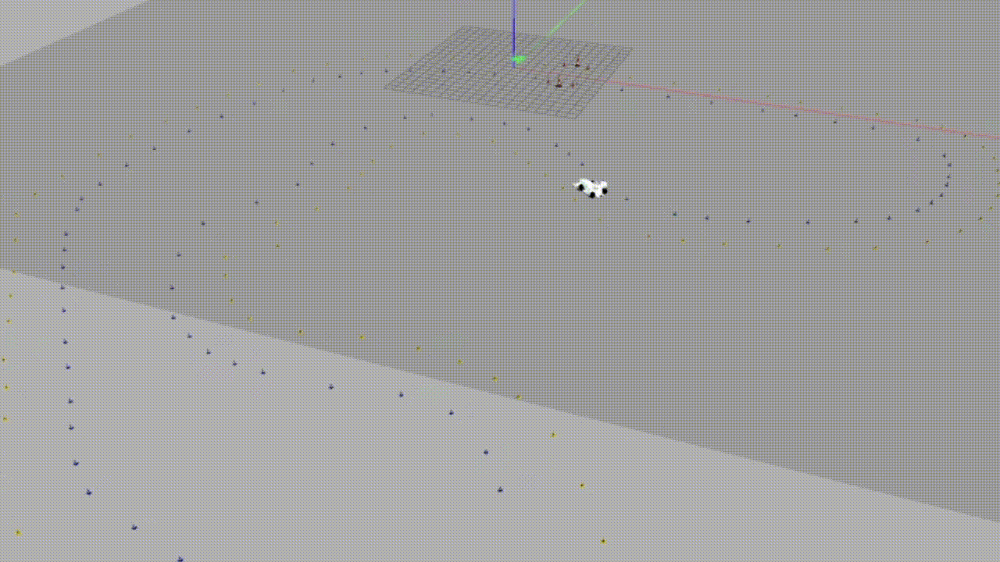

## Autonomous racing vehicle for the 2023 season

Introducing the 2023 UPC ecoRacing Formula Student car. As the head of the driverless department, I'm thrilled to highlight our notable advancements, the wollowing of which I played a key role in:
- Enhanced sensor and camera suite for robust performance
- Upgraded stable lateral control system
- Implementation of Neuronal PID for optimized speed control

---

### New vehicle
This vehicle marks the team's 15th year building racecars, which was deserving of a special livery.

 

---

### Camera module
In my role this season, I was responsible for designing the new camera module. To optimize aerodynamics and component placement, I opted for an organic design that leveraged 3D printing technologies.

 

---

### Control improvements
I made significant enhancements to the car's lateral controller, incorporating a stability criterion that enables it to operate at its limits. Additionally, the implementation of a new adaptive neuronal PID controller ensures optimal speed control.

 
