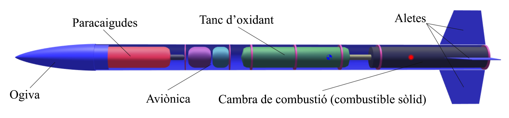
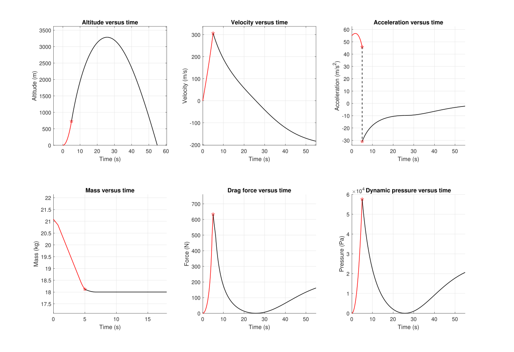
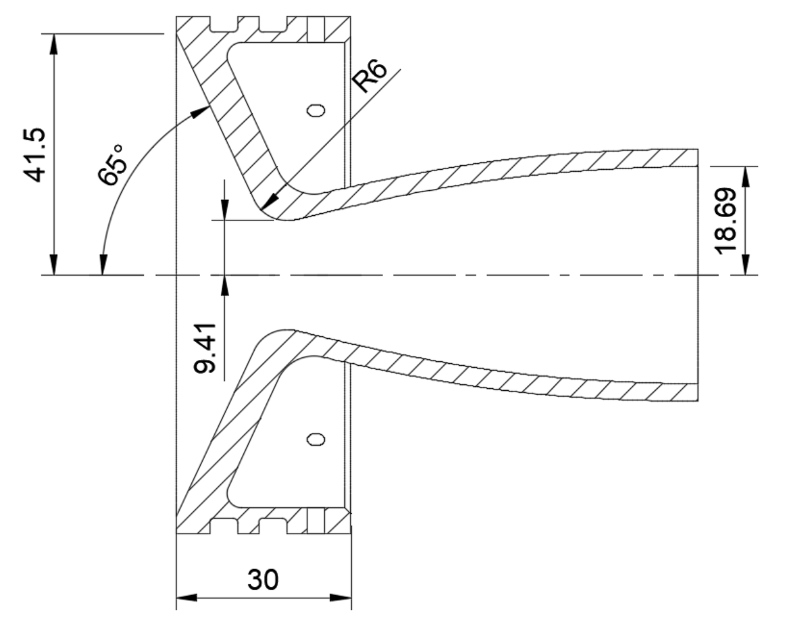

## Hybrid rocket engine for EUROC
This was part of a class project where there were no limits to what we could do, so we decided to design a rocket to compete in the EUROC challenge. I ended up doing a major part of the design of the propulsion system and of flight simulation, bringing together many of the fields we have seen in class such as compressible fluid mechanics, structural engineering, flight mechanics, etc.

 

---

### Flight simulation
The first step in the design process was to create a simulation tool to quickly iterate until we had a design that fulfilled the mission specifications

 

---

### Engine design
The design of the engine itself was done taking into account the chemistry of the combustion, the thermodynamics and fluid mechanics of the hot exhaust gases, the strength of the components, and how the manufacturing could be done.

 
The method of characteristics was used to design the nozzle

 

---