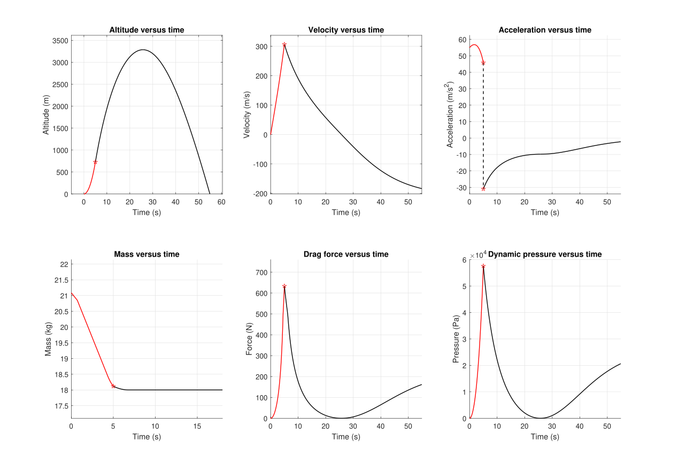

## Hybrid rocket engine for EUROC
For a class project with no limitations, we designed a rocket for the EUROC challenge. I took on a significant role in designing the propulsion system and conducting flight simulations. This involved integrating various subjects from our class, including compressible fluid mechanics, structural engineering, and flight mechanics.

 

---

### Flight simulation
The first step in the design process was to create a simulation tool to quickly iterate until we had a design that fulfilled the mission specifications

 

---

### Engine design
The design of the engine itself was done taking into account the chemistry of the combustion, the thermodynamics and fluid mechanics of the hot exhaust gases, the strength of the components, and how the manufacturing could be done.

 
The method of characteristics was used to design the nozzle

 

---