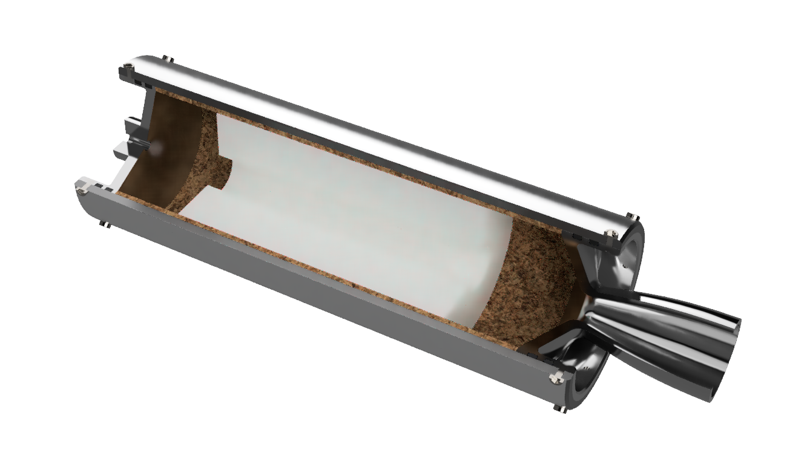

# Portfolio:

---

## [Regional Turboprop Airliner Aerodynamic Design](/projectsPlane)

---

## [Autonomous racing vehicle ecoRD 2023](/ecoRD2023)

---

## [Hybrid rocket design](/hybrid_engine)

---
## [Ground Effect vehicle CFD analysis](/CFD_project)

---
## [Titan lander](/titan_lander_page)

---

### Curriculum Vitae

[Click here to download](/pdf/CV_webpage.pdf)

---
---

Page template forked from <a href="https://github.com/evanca/quick-portfolio">evanca</a>

<!-- Remove above link if you don't want to attibute -->
