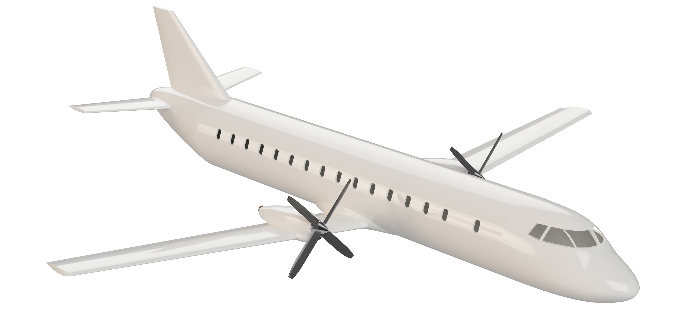
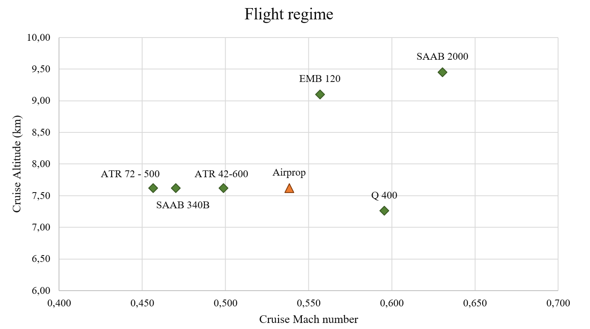
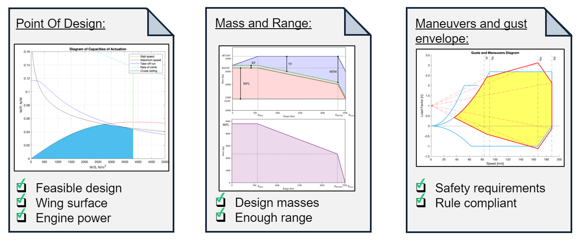
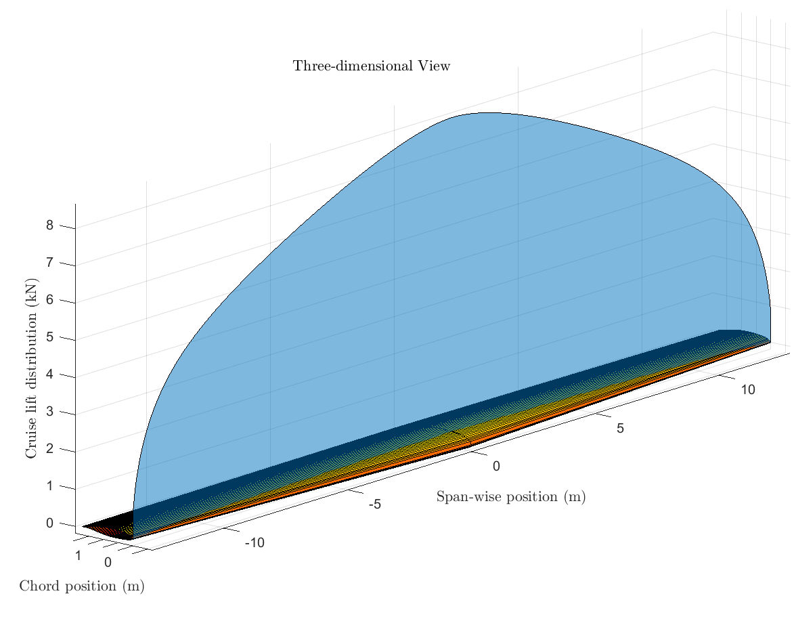
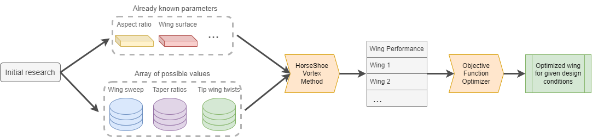

## Regional Turbopropeller Passenger Aircraft Design

In our Projects subject, our team undertook the ambitious task of designing a regional turbopropeller passenger aircraft. My role in the project focused on aerodynamics, where I made significant contributions to optimizing the aircraft's performance and range, taking major decisions in the wing design.

 

---

### Client needs

The entire project was centered around our client's needs, which were to carry 50 passengers from the Balearic Islands to Barcelona and Madrid using a turbopropeller-based aircraft, competitive in the market. The AirProp 150 was our answer.

---

### Aerodynamic Analysis and Design

### Preliminary Calculations

In order to obtain preliminary range and weight figures, I started by deriving analytical expressions of the Breguet equation tailored specifically to our aircraft's flight profile, finding novel equations which did not sacrifice accuracy and necessitated no numerical solution. These calculations played a crucial role in determining the aircraft's weights and optimizing its range performance. This was crucial for the following design steps such as the Point Of Design and the Gust-Maneuver diagram, which were carried out by the team as part of the preliminary design.

 

### Wing Design

I personally led the design process for the aircraft's wings. This involved meticulous airfoil selection, which was performed using project-oriented decision-making techniques such as the OWA and PRESS methods, as well as performance evaluation to ensure optimal aerodynamic efficiency and lift characteristics for a preliminary design.

 

To further refine the wing design, I employed a numerical optimization approach using a discretized horseshoe vortex method solver based on lifting line theory. This process enabled us to identify the most suitable wing shape to meet our performance requirements.

### Achievements and Recognition

I am proud to have received honors for my work in the Projects subject, a large part of which comes from my work in aerodynamics and wing design. Our team's collaborative effort and dedication resulted in a successful outcome, demonstrating our ability to tackle complex engineering challenges.

