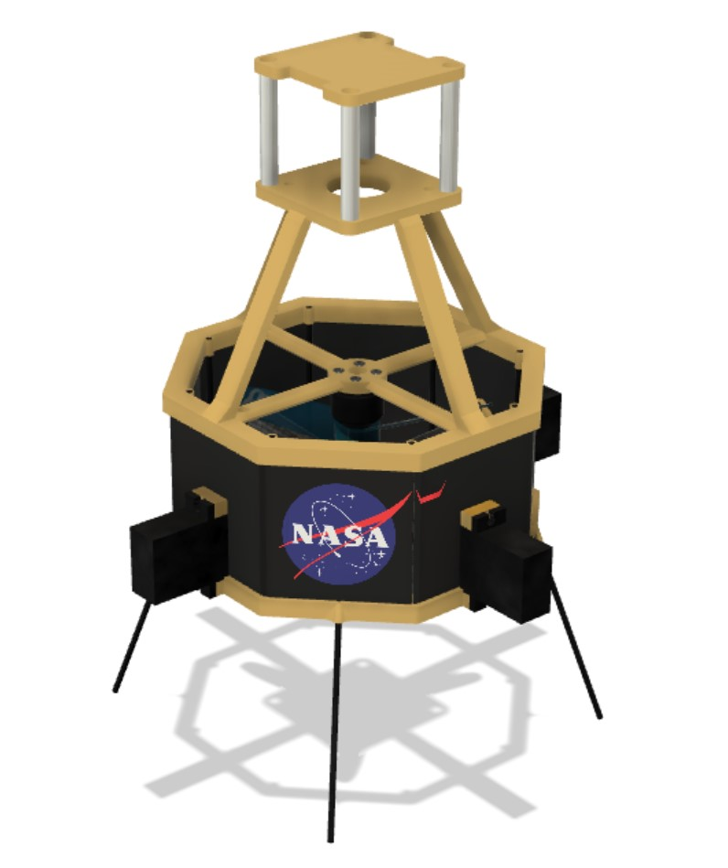
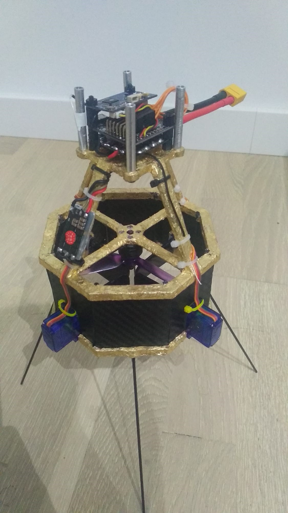
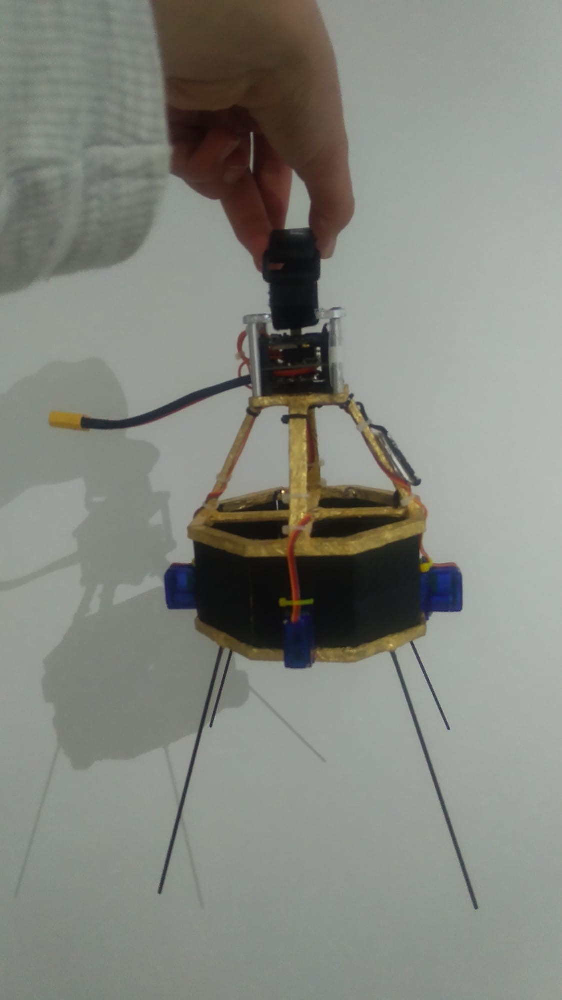
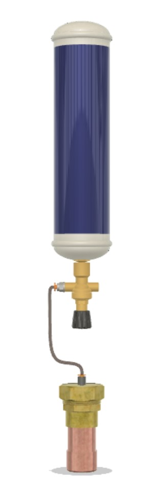
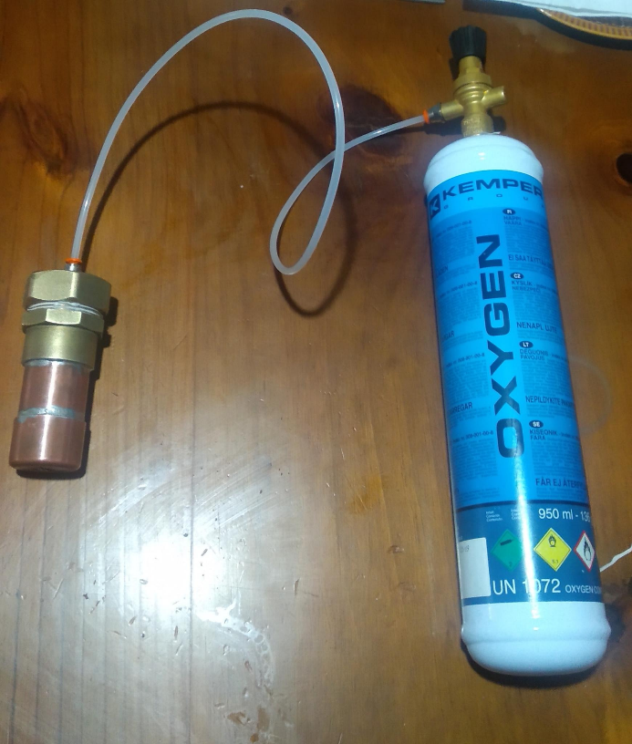
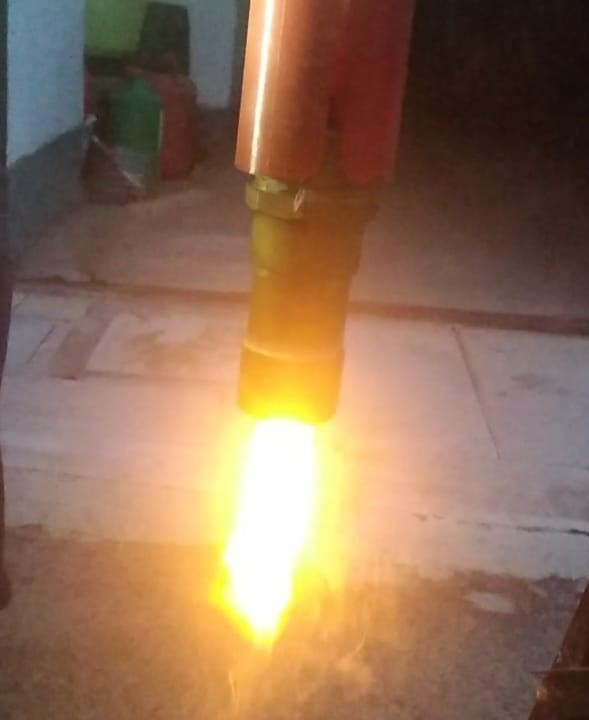

## Titan Lander

This was my Baccalaureate research project in which I designed a mission to send and land a small helicopter probe on the surface of Titan, one of Saturn's moon. The mission consisted of two main parts.

---

### Titan Lander probe

This small vehicle has the capability of autonomous flight in Titan's (and earth's) atmosphere. 3d printing was used to manufacture the most complex parts.

 

---

### Hybrid rocket engine technology demonstrator

A small hybrid rocket engine was built and tested as a scale demonstrator of an interplanetary rocket stage.

